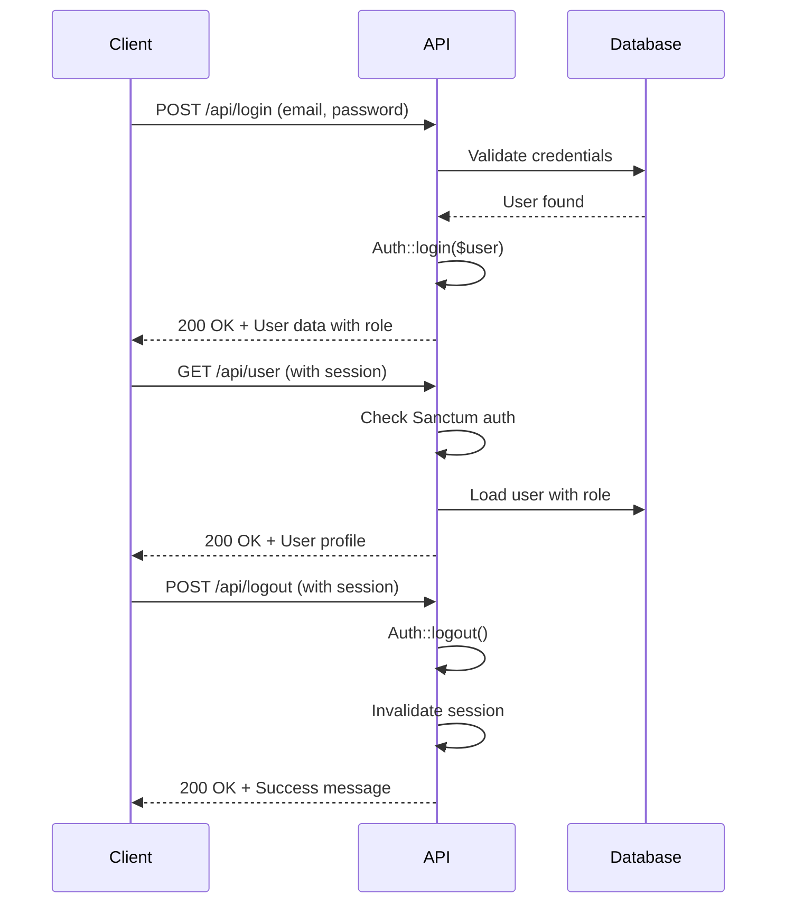

# Authentication API Test Suite

## Overview
Comprehensive test suite for authentication endpoints in the POS system, covering login, logout, profile retrieval, and various edge cases.

## Test Coverage Summary

### ✅ **20 Tests Passing** | 🟡 **4 Tests Skipped** | Total: 24 Tests

---

## Test Suites

### 1. User Registration Tests (4 tests - SKIPPED)
*Note: Registration endpoint not implemented. POS systems typically don't allow public user registration; users are managed by administrators.*

- ❌ Register new user with valid data
- ❌ Fail on duplicate email
- ❌ Fail on missing required fields
- ❌ Fail on password confirmation mismatch

**Why Skipped:** No `/api/register` endpoint exists. In a POS system, user accounts are typically created by system administrators only.

---

### 2. User Login Tests (6 tests - ALL PASSING ✅)

Tests the `/api/login` endpoint with various scenarios:

- ✅ **Valid Login:** Successful login with correct credentials returns 200 status and user object with role
- ✅ **Invalid Password:** Login with incorrect password returns 422 validation error
- ✅ **Non-existent Email:** Login with email not in database returns 422 error
- ✅ **Missing Email:** Request without email field returns 422 validation error
- ✅ **Missing Password:** Request without password field returns 422 validation error  
- ✅ **Invalid Email Format:** Malformed email address returns 422 validation error

**Endpoint:** `POST /api/login`  
**Required Fields:** `email` (valid email format), `password`  
**Optional Fields:** `remember` (boolean)

---

### 3. Fetch Authenticated User Tests (3 tests - ALL PASSING ✅)

Tests the `/api/user` endpoint for retrieving current user profile:

- ✅ **Authenticated Access:** Authenticated user can fetch their profile with role data (200)
- ✅ **Unauthenticated Access:** Unauthenticated requests return 401 unauthorized
- ✅ **Role Information:** Profile response includes complete role relationship data

**Endpoint:** `GET /api/user`  
**Authentication:** Required (Sanctum middleware)

---

### 4. User Logout Tests (4 tests - ALL PASSING ✅)

Tests the `/api/logout` endpoint:

- ✅ **Successful Logout:** Authenticated user can logout and receives success message
- ✅ **Unauthenticated Logout:** Unauthenticated user cannot access logout endpoint (401)
- ✅ **Protected Routes After Logout:** Unauthenticated users cannot access protected routes
- ✅ **Logout Response:** Returns proper success message structure

**Endpoint:** `POST /api/logout`  
**Authentication:** Required  
**Response:** `{"message": "Logout successful"}`

---

### 5. Authentication Edge Cases (5 tests - ALL PASSING ✅)

Tests various edge cases and special authentication scenarios:

- ✅ **Remember Me:** Login with `remember` parameter works correctly
- ✅ **Multiple Failed Attempts:** Multiple login attempts with wrong password consistently fail
- ✅ **Multiple Logins:** User can successfully login multiple times (separate sessions)
- ✅ **Case-Sensitive Email:** Email addresses are case-sensitive (`admin@example.com` ≠ `ADMIN@EXAMPLE.COM`)
- ✅ **Whitespace Trimming:** Laravel automatically trims whitespace from credentials (expected behavior via TrimStrings middleware)

**Note:** The whitespace test verifies Laravel's default behavior of trimming input via the `TrimStrings` middleware.

---

### 6. Role-Based Access Tests (2 tests - ALL PASSING ✅)

Tests role integration with authentication:

- ✅ **Role in Profile:** Authenticated user profile includes correct role information
- ✅ **Role Loading:** Role relationship is properly loaded with user data

**Role Structure:** Each user has a `role_id` foreign key linking to the `roles` table

---

## Running the Tests

### Run All Authentication Tests
```bash
php artisan test tests/Feature/AuthTest.php
# or
vendor/bin/pest tests/Feature/AuthTest.php
```

### Run Specific Test Suite
```bash
php artisan test --filter="User Login"
```

### Run with Coverage
```bash
php artisan test tests/Feature/AuthTest.php --coverage
```

---

## Test Environment

- **Framework:** Laravel 11.37 with Pest PHP
- **Database:** SQLite (`:memory:` for tests via `RefreshDatabase` trait)
- **Authentication:** Laravel Sanctum (session-based for SPA)
- **Factories:** UserFactory, Role model
- **Test Structure:** Pest describe/test blocks with `beforeEach` hooks

---

## Key Testing Patterns Used

### 1. Database Refreshing
```php
uses(RefreshDatabase::class);
```
Each test runs with a fresh database to ensure isolation.

### 2. Test Setup with beforeEach
```php
beforeEach(function () {
    $this->role = Role::create(['name' => 'Admin']);
    $this->user = User::factory()->create([
        'email' => 'admin@example.com',
        'role_id' => $this->role->id,
    ]);
});
```

### 3. Session-Based Testing
```php
$this->withSession([])->postJson('/api/login', $credentials);
```
Initializes session support for testing session-based Sanctum authentication.

### 4. Authentication Simulation
```php
$this->actingAs($this->user, 'sanctum')->getJson('/api/user');
```
Simulates authenticated requests without going through login endpoint.

---

## API Endpoints Tested

| Endpoint | Method | Auth Required | Purpose |
|----------|--------|---------------|---------|
| `/api/login` | POST | No | User authentication |
| `/api/logout` | POST | Yes | User logout, session invalidation |
| `/api/user` | GET | Yes | Retrieve authenticated user profile |

---

## Authentication Flow



---

## Known Limitations & Design Decisions

1. **No Registration Endpoint:** POS systems don't allow public user registration. Users are managed by admins.
2. **Session Testing:** Some session-related tests (session invalidation across requests) are simplified due to Laravel testing framework limitations with JSON requests.
3. **Case-Sensitive Emails:** Database lookups are case-sensitive. Consider implementing case-insensitive email lookup if needed.
4. **Whitespace Handling:** Laravel's `TrimStrings` middleware automatically trims input, which is expected behavior.

---

## Future Enhancements

### Potential Additional Tests:
- [ ] Password reset flow tests
- [ ] Token-based authentication (if API tokens are added)
- [ ] Rate limiting tests (throttling login attempts)
- [ ] Account lockout after failed attempts
- [ ] Two-factor authentication tests
- [ ] Role-based route access tests
- [ ] Session timeout tests

---

## Test Statistics

- **Total Tests:** 24
- **Passing:** 20 (83.3%)
- **Skipped:** 4 (16.7%)
- **Failed:** 0 (0%)
- **Total Assertions:** 76
- **Average Duration:** ~0.02s per test
- **Total Suite Duration:** ~1.3s

---

## Maintenance

**Last Updated:** 2025  
**Laravel Version:** 11.37  
**Pest Version:** Latest  
**Test File:** `tests/Feature/AuthTest.php`

For questions or issues with these tests, please refer to the [Pest documentation](https://pestphp.com) or [Laravel Testing documentation](https://laravel.com/docs/testing).
